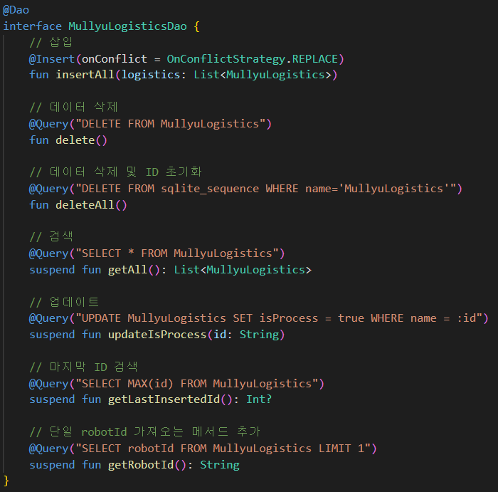

# 삼성 청년 SW 아카데미 공통 프로젝트 AtwoZ팀 - 류(流) : Wear OS

 

## 류의 Wear OS와 관련된 내용을 담고 있는 문서입니다. 전체 프로젝트에 대한 문서는 아래 링크를 따라가주세요.

# [전체 프로젝트 보러가기](https://github.com/A-two-Z)

 

 

# 류 UCC

    

 

# Wear OS

    

- **Wear OS**: 스마트 워치를 활용해 작업자가 기존의 PDA보다 훨씬 효율적으로 작업할 수 있게 도울 수 있습니다. MQTT를 활용해 로봇과 통신하며 실시간으로 필요한 물류들을 요청하고 다음 목표로 이동 명령을 내릴 수 있습니다.

 

# 상세설명

#### Wear OS와 MQTT 통신

    

- **MQTT**: 로봇과 실시간 통신을 위해 경량화 프로토콜인 MQTT를 사용해서 통신합니다. 기본적으로 통신하기 위한 브로커의 주소를 `.env` 파일에서 관리하도록하여 보안성을 높혔습니다. 

### 라이프사이클에서 하나의 객체만을 보장하기 위한 Singleton

    

- **Signleton**: 안드로이드의 라이프사이클에 따라 화면이 꺼졌다가 켜졌을 때, 즉 Pause에서 Resume 상태로 전환될 때 기존 객체를 이용할 수 없어 앱이 작동을 멈추는 상황이 발생하기 때문에 이를 해결하기 위해 데이터 관리 객체를 싱글톤으로 설계하고 사용하였습니다.  

### RoomDatabase를 활용한 안정성 확보

    

- **RoomDatabase**: 물류 창고 내에서는 통신 환경이 매우 열악하기 때문에 연결이 끊기거나 앱이 종료되는 등 예상치 못한 상황이 발생할 수 있습니다. 요청받은 업무를 완료하지 못한 상태에서 앱이 종료되면 요청을 보낸 로봇은 그대로 무한대기 상태에 빠지기 때문에 이를 해결하기 위해 `RoomDatabase`를 활용해 내부적으로도 데이터를 관리할 수 있도록 하였습니다.
